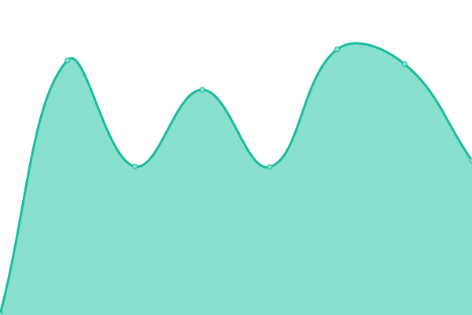

# [📈 Live Status](https://thomasmerz.github.io/upptime): <!--live status--> **🟩 All systems operational**

This repository contains the open-source uptime monitor and status page for [thomasmerz](https://thomasmerz.github.io/upptime), powered by [Upptime](https://github.com/upptime/upptime).

With [Upptime](https://upptime.js.org), you can get your own unlimited and free uptime monitor and status page, powered entirely by a GitHub repository. We use [Issues](https://github.com/thomasmerz/upptime/issues) as incident reports, [Actions](https://github.com/thomasmerz/upptime/actions) as uptime monitors, and [Pages](https://thomasmerz.github.io/upptime) for the status page.

<!--start: status pages-->
<!-- This summary is generated by Upptime (https://github.com/upptime/upptime) -->
<!-- Do not edit this manually, your changes will be overwritten -->
<!-- prettier-ignore -->
| URL | Status | History | Response Time | Uptime |
| --- | ------ | ------- | ------------- | ------ |
|  Nextcloud | 🟩 Up | [nextcloud.yml](https://github.com/thomasmerz/upptime/commits/HEAD/history/nextcloud.yml) | 

 905ms
     
 | 

<a href="https://thomasmerz.github.io/upptime/history/nextcloud">100.00%</a>
    

|  Storagebox | 🟩 Up | [storagebox.yml](https://github.com/thomasmerz/upptime/commits/HEAD/history/storagebox.yml) | 

 127ms
     
 | 

<a href="https://thomasmerz.github.io/upptime/history/storagebox">100.00%</a>
    

|  Pihole-NBG | 🟩 Up | [pihole-nbg.yml](https://github.com/thomasmerz/upptime/commits/HEAD/history/pihole-nbg.yml) | 

 792ms
     
 | 

<a href="https://thomasmerz.github.io/upptime/history/pihole-nbg">100.00%</a>
    

|  Pihole-HEL | 🟩 Up | [pihole-hel.yml](https://github.com/thomasmerz/upptime/commits/HEAD/history/pihole-hel.yml) | 

 946ms
     
 | 

<a href="https://thomasmerz.github.io/upptime/history/pihole-hel">100.00%</a>
    

|  Pihole-FSN | 🟩 Up | [pihole-fsn.yml](https://github.com/thomasmerz/upptime/commits/HEAD/history/pihole-fsn.yml) | 

 795ms
     
 | 

<a href="https://thomasmerz.github.io/upptime/history/pihole-fsn">99.62%</a>
    

|  Pihole-KA | 🟩 Up | [pihole-ka.yml](https://github.com/thomasmerz/upptime/commits/HEAD/history/pihole-ka.yml) | 

 1048ms
     
 | 

<a href="https://thomasmerz.github.io/upptime/history/pihole-ka">100.00%</a>
    

|  Syncthing-NBG | 🟩 Up | [syncthing-nbg.yml](https://github.com/thomasmerz/upptime/commits/HEAD/history/syncthing-nbg.yml) | 

 639ms
     
 | 

<a href="https://thomasmerz.github.io/upptime/history/syncthing-nbg">100.00%</a>
    

|  Syncthing-FSN | 🟩 Up | [syncthing-fsn.yml](https://github.com/thomasmerz/upptime/commits/HEAD/history/syncthing-fsn.yml) | 

 649ms
     
 | 

<a href="https://thomasmerz.github.io/upptime/history/syncthing-fsn">100.00%</a>
    

|  Syncthing-HEL | 🟩 Up | [syncthing-hel.yml](https://github.com/thomasmerz/upptime/commits/HEAD/history/syncthing-hel.yml) | 

 855ms
     
 | 

<a href="https://thomasmerz.github.io/upptime/history/syncthing-hel">100.00%</a>
    

|  Syncthing-KA-TM | 🟩 Up | [syncthing-ka-tm.yml](https://github.com/thomasmerz/upptime/commits/HEAD/history/syncthing-ka-tm.yml) | 

 810ms
     
 | 

<a href="https://thomasmerz.github.io/upptime/history/syncthing-ka-tm">100.00%</a>
    

|  Syncthing-KA-BI | 🟩 Up | [syncthing-ka-bi.yml](https://github.com/thomasmerz/upptime/commits/HEAD/history/syncthing-ka-bi.yml) | 

 851ms
     
 | 

<a href="https://thomasmerz.github.io/upptime/history/syncthing-ka-bi">100.00%</a>
    

|  Syncthing-Karlsruhe.social | 🟩 Up | [syncthing-karlsruhe-social.yml](https://github.com/thomasmerz/upptime/commits/HEAD/history/syncthing-karlsruhe-social.yml) | 

 821ms
     
 | 

<a href="https://thomasmerz.github.io/upptime/history/syncthing-karlsruhe-social">100.00%</a>
    

|  Portainer-NBG | 🟩 Up | [portainer-nbg.yml](https://github.com/thomasmerz/upptime/commits/HEAD/history/portainer-nbg.yml) | 

 652ms
     
 | 

<a href="https://thomasmerz.github.io/upptime/history/portainer-nbg">100.00%</a>
    

|  Portainer-HEL | 🟩 Up | [portainer-hel.yml](https://github.com/thomasmerz/upptime/commits/HEAD/history/portainer-hel.yml) | 

 751ms
     
 | 

<a href="https://thomasmerz.github.io/upptime/history/portainer-hel">100.00%</a>
    

|  Portainer-FSN | 🟩 Up | [portainer-fsn.yml](https://github.com/thomasmerz/upptime/commits/HEAD/history/portainer-fsn.yml) | 

 570ms
     
 | 

<a href="https://thomasmerz.github.io/upptime/history/portainer-fsn">100.00%</a>
    

|  Portainer-KA | 🟩 Up | [portainer-ka.yml](https://github.com/thomasmerz/upptime/commits/HEAD/history/portainer-ka.yml) | 

 744ms
     
 | 

<a href="https://thomasmerz.github.io/upptime/history/portainer-ka">100.00%</a>
    

|  Netdata-NBG | 🟩 Up | [netdata-nbg.yml](https://github.com/thomasmerz/upptime/commits/HEAD/history/netdata-nbg.yml) | 

 574ms
     
 | 

<a href="https://thomasmerz.github.io/upptime/history/netdata-nbg">100.00%</a>
    

|  Netdata-HEL | 🟩 Up | [netdata-hel.yml](https://github.com/thomasmerz/upptime/commits/HEAD/history/netdata-hel.yml) | 

 734ms
     
 | 

<a href="https://thomasmerz.github.io/upptime/history/netdata-hel">100.00%</a>
    

|  Netdata-FSN | 🟩 Up | [netdata-fsn.yml](https://github.com/thomasmerz/upptime/commits/HEAD/history/netdata-fsn.yml) | 

 511ms
     
 | 

<a href="https://thomasmerz.github.io/upptime/history/netdata-fsn">100.00%</a>
    

|  Netdata-KA | 🟩 Up | [netdata-ka.yml](https://github.com/thomasmerz/upptime/commits/HEAD/history/netdata-ka.yml) | 

 684ms
     
 | 

<a href="https://thomasmerz.github.io/upptime/history/netdata-ka">95.51%</a>
    

|  Netdata-Karlsruhe.Social | 🟩 Up | [netdata-karlsruhe-social.yml](https://github.com/thomasmerz/upptime/commits/HEAD/history/netdata-karlsruhe-social.yml) | 

 508ms
     
 | 

<a href="https://thomasmerz.github.io/upptime/history/netdata-karlsruhe-social">95.33%</a>
    

|  Speedtest-v2-NBG1-1 | 🟩 Up | [speedtest-v2-nbg-1-1.yml](https://github.com/thomasmerz/upptime/commits/HEAD/history/speedtest-v2-nbg-1-1.yml) | 

 1128ms
     
 | 

<a href="https://thomasmerz.github.io/upptime/history/speedtest-v2-nbg-1-1">100.00%</a>
    

|  Speedtest-v2-HEL1-1 | 🟩 Up | [speedtest-v2-hel-1-1.yml](https://github.com/thomasmerz/upptime/commits/HEAD/history/speedtest-v2-hel-1-1.yml) | 

 1694ms
     
 | 

<a href="https://thomasmerz.github.io/upptime/history/speedtest-v2-hel-1-1">100.00%</a>
    

|  Speedtest-v2-FSN1-1 | 🟩 Up | [speedtest-v2-fsn-1-1.yml](https://github.com/thomasmerz/upptime/commits/HEAD/history/speedtest-v2-fsn-1-1.yml) | 

 937ms
     
 | 

<a href="https://thomasmerz.github.io/upptime/history/speedtest-v2-fsn-1-1">100.00%</a>
    

|  Speedtest-v2-KA | 🟩 Up | [speedtest-v2-ka.yml](https://github.com/thomasmerz/upptime/commits/HEAD/history/speedtest-v2-ka.yml) | 

 1662ms
     
 | 

<a href="https://thomasmerz.github.io/upptime/history/speedtest-v2-ka">100.00%</a>
    

|  OpenVPN-KA | 🟩 Up | [open-vpn-ka.yml](https://github.com/thomasmerz/upptime/commits/HEAD/history/open-vpn-ka.yml) | 

 150ms
     
 | 

<a href="https://thomasmerz.github.io/upptime/history/open-vpn-ka">100.00%</a>
    

|  Dashboards-NBG | 🟩 Up | [dashboards-nbg.yml](https://github.com/thomasmerz/upptime/commits/HEAD/history/dashboards-nbg.yml) | 

 410ms
     
 | 

<a href="https://thomasmerz.github.io/upptime/history/dashboards-nbg">100.00%</a>
    

|  Dashboards-HEL | 🟩 Up | [dashboards-hel.yml](https://github.com/thomasmerz/upptime/commits/HEAD/history/dashboards-hel.yml) | 

 693ms
     
 | 

<a href="https://thomasmerz.github.io/upptime/history/dashboards-hel">100.00%</a>
    

|  Dashboards-FSN | 🟩 Up | [dashboards-fsn.yml](https://github.com/thomasmerz/upptime/commits/HEAD/history/dashboards-fsn.yml) | 

 398ms
     
 | 

<a href="https://thomasmerz.github.io/upptime/history/dashboards-fsn">100.00%</a>
    

|  Metalhead-Heaven-NBG | 🟩 Up | [metalhead-heaven-nbg.yml](https://github.com/thomasmerz/upptime/commits/HEAD/history/metalhead-heaven-nbg.yml) | 

 383ms
     
 | 

<a href="https://thomasmerz.github.io/upptime/history/metalhead-heaven-nbg">100.00%</a>
    

|  Metalhead-Heaven-HEL | 🟩 Up | [metalhead-heaven-hel.yml](https://github.com/thomasmerz/upptime/commits/HEAD/history/metalhead-heaven-hel.yml) | 

 466ms
     
 | 

<a href="https://thomasmerz.github.io/upptime/history/metalhead-heaven-hel">100.00%</a>
    

|  Metalhead-Heaven-FSN | 🟩 Up | [metalhead-heaven-fsn.yml](https://github.com/thomasmerz/upptime/commits/HEAD/history/metalhead-heaven-fsn.yml) | 

 394ms
     
 | 

<a href="https://thomasmerz.github.io/upptime/history/metalhead-heaven-fsn">100.00%</a>
    

|  [Mastodon Fulda.social](https://fulda.social) | 🟩 Up | [mastodon-fulda-social.yml](https://github.com/thomasmerz/upptime/commits/HEAD/history/mastodon-fulda-social.yml) | 

 995ms
     
 | 

<a href="https://thomasmerz.github.io/upptime/history/mastodon-fulda-social">100.00%</a>
    

|  [Mastodon Karlsruhe.social](https://karlsruhe-social.de) | 🟩 Up | [mastodon-karlsruhe-social.yml](https://github.com/thomasmerz/upptime/commits/HEAD/history/mastodon-karlsruhe-social.yml) | 

 650ms
     
 | 

<a href="https://thomasmerz.github.io/upptime/history/mastodon-karlsruhe-social">100.00%</a>
    

|  [CDN for Media CCC](https://cdn.media.ccc.de) | 🟩 Up | [cdn-for-media-ccc.yml](https://github.com/thomasmerz/upptime/commits/HEAD/history/cdn-for-media-ccc.yml) | 

 1453ms
     
 | 

<a href="https://thomasmerz.github.io/upptime/history/cdn-for-media-ccc">100.00%</a>
    

|  [Codeberg](https://codeberg.org/thomasmerz) | 🟩 Up | [codeberg.yml](https://github.com/thomasmerz/upptime/commits/HEAD/history/codeberg.yml) | 

 1153ms
     
 | 

<a href="https://thomasmerz.github.io/upptime/history/codeberg">99.58%</a>
    

|  [Forgejo](https://code.forgejo.org/thomasmerz) | 🟩 Up | [forgejo.yml](https://github.com/thomasmerz/upptime/commits/HEAD/history/forgejo.yml) | 

 861ms
     
 | 

<a href="https://thomasmerz.github.io/upptime/history/forgejo">100.00%</a>
    

|  [Gitea](https://gitea.com/explore/repos) | 🟩 Up | [gitea.yml](https://github.com/thomasmerz/upptime/commits/HEAD/history/gitea.yml) | 

 566ms
     
 | 

<a href="https://thomasmerz.github.io/upptime/history/gitea">100.00%</a>
    

|  [GitHub](https://github.com/thomasmerz/) | 🟩 Up | [git-hub.yml](https://github.com/thomasmerz/upptime/commits/HEAD/history/git-hub.yml) | 

 458ms
     
 | 

<a href="https://thomasmerz.github.io/upptime/history/git-hub">100.00%</a>
    

|  [GitLab](https://gitlab.com/explore) | 🟩 Up | [git-lab.yml](https://github.com/thomasmerz/upptime/commits/HEAD/history/git-lab.yml) | 

 802ms
     
 | 

<a href="https://thomasmerz.github.io/upptime/history/git-lab">100.00%</a>
    

<!--end: status pages-->

[**Visit our status website →**](https://thomasmerz.github.io/upptime)

## 📄 License

- Powered by: [Upptime](https://github.com/upptime/upptime)
- Code: [MIT](./LICENSE) © [thomasmerz](https://thomasmerz.github.io/upptime)
- Data in the `./history` directory: [Open Database License](https://opendatacommons.org/licenses/odbl/1-0/)
