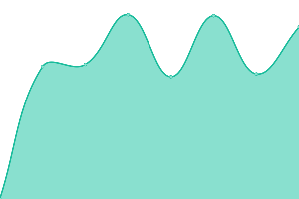
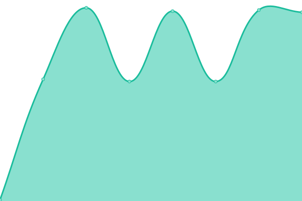

# [📈 Live Status](https://thomasmerz.github.io/upptime): <!--live status--> **🟧 Partial outage**

This repository contains the open-source uptime monitor and status page for [thomasmerz](https://thomasmerz.github.io/upptime), powered by [Upptime](https://github.com/upptime/upptime).

With [Upptime](https://upptime.js.org), you can get your own unlimited and free uptime monitor and status page, powered entirely by a GitHub repository. We use [Issues](https://github.com/thomasmerz/upptime/issues) as incident reports, [Actions](https://github.com/thomasmerz/upptime/actions) as uptime monitors, and [Pages](https://thomasmerz.github.io/upptime) for the status page.

<!--start: status pages-->
<!-- This summary is generated by Upptime (https://github.com/upptime/upptime) -->
<!-- Do not edit this manually, your changes will be overwritten -->
<!-- prettier-ignore -->
| URL | Status | History | Response Time | Uptime |
| --- | ------ | ------- | ------------- | ------ |
|  Nextcloud | 🟩 Up | [nextcloud.yml](https://github.com/thomasmerz/upptime/commits/HEAD/history/nextcloud.yml) | 

 907ms
     
 | 

<a href="https://thomasmerz.github.io/upptime/history/nextcloud">100.00%</a>
    

|  Pihole-NBG | 🟩 Up | [pihole-nbg.yml](https://github.com/thomasmerz/upptime/commits/HEAD/history/pihole-nbg.yml) | 

 253ms
     
 | 

<a href="https://thomasmerz.github.io/upptime/history/pihole-nbg">100.00%</a>
    

|  Pihole-HEL | 🟩 Up | [pihole-hel.yml](https://github.com/thomasmerz/upptime/commits/HEAD/history/pihole-hel.yml) | 

 301ms
     
 | 

<a href="https://thomasmerz.github.io/upptime/history/pihole-hel">100.00%</a>
    

|  Pihole-KA | 🟨 Degraded | [pihole-ka.yml](https://github.com/thomasmerz/upptime/commits/HEAD/history/pihole-ka.yml) | 

 6317ms
     
 | 

<a href="https://thomasmerz.github.io/upptime/history/pihole-ka">99.48%</a>
    

|  Syncthing-NBG | 🟩 Up | [syncthing-nbg.yml](https://github.com/thomasmerz/upptime/commits/HEAD/history/syncthing-nbg.yml) | 

 553ms
     
 | 

<a href="https://thomasmerz.github.io/upptime/history/syncthing-nbg">100.00%</a>
    

|  Syncthing-HEL | 🟩 Up | [syncthing-hel.yml](https://github.com/thomasmerz/upptime/commits/HEAD/history/syncthing-hel.yml) | 

 634ms
     
 | 

<a href="https://thomasmerz.github.io/upptime/history/syncthing-hel">99.76%</a>
    

|  Syncthing-contabo-mo | 🟩 Up | [syncthing-contabo-mo.yml](https://github.com/thomasmerz/upptime/commits/HEAD/history/syncthing-contabo-mo.yml) | 

 546ms
     
 | 

<a href="https://thomasmerz.github.io/upptime/history/syncthing-contabo-mo">100.00%</a>
    

|  Syncthing-KA-TM | 🟥 Down | [syncthing-ka-tm.yml](https://github.com/thomasmerz/upptime/commits/HEAD/history/syncthing-ka-tm.yml) | 

 559ms
     
 | 

<a href="https://thomasmerz.github.io/upptime/history/syncthing-ka-tm">99.98%</a>
    

|  Syncthing-KA-BI | 🟨 Degraded | [syncthing-ka-bi.yml](https://github.com/thomasmerz/upptime/commits/HEAD/history/syncthing-ka-bi.yml) | 

 2030ms
     
 | 

<a href="https://thomasmerz.github.io/upptime/history/syncthing-ka-bi">99.99%</a>
    

|  Portainer-NBG | 🟩 Up | [portainer-nbg.yml](https://github.com/thomasmerz/upptime/commits/HEAD/history/portainer-nbg.yml) | 

 415ms
     
 | 

<a href="https://thomasmerz.github.io/upptime/history/portainer-nbg">100.00%</a>
    

|  Portainer-HEL | 🟩 Up | [portainer-hel.yml](https://github.com/thomasmerz/upptime/commits/HEAD/history/portainer-hel.yml) | 

 575ms
     
 | 

<a href="https://thomasmerz.github.io/upptime/history/portainer-hel">100.00%</a>
    

|  Portainer-KA | 🟥 Down | [portainer-ka.yml](https://github.com/thomasmerz/upptime/commits/HEAD/history/portainer-ka.yml) | 

 445ms
     
 | 

<a href="https://thomasmerz.github.io/upptime/history/portainer-ka">99.99%</a>
    

|  Netdata-NBG | 🟩 Up | [netdata-nbg.yml](https://github.com/thomasmerz/upptime/commits/HEAD/history/netdata-nbg.yml) | 

 375ms
     
 | 

<a href="https://thomasmerz.github.io/upptime/history/netdata-nbg">100.00%</a>
    

|  Netdata-HEL | 🟩 Up | [netdata-hel.yml](https://github.com/thomasmerz/upptime/commits/HEAD/history/netdata-hel.yml) | 

 439ms
     
 | 

<a href="https://thomasmerz.github.io/upptime/history/netdata-hel">100.00%</a>
    

|  Netdata-contabo-mo | 🟩 Up | [netdata-contabo-mo.yml](https://github.com/thomasmerz/upptime/commits/HEAD/history/netdata-contabo-mo.yml) | 

 387ms
     
 | 

<a href="https://thomasmerz.github.io/upptime/history/netdata-contabo-mo">100.00%</a>
    

|  Netdata-KA | 🟩 Up | [netdata-ka.yml](https://github.com/thomasmerz/upptime/commits/HEAD/history/netdata-ka.yml) | 

 418ms
     
 | 

<a href="https://thomasmerz.github.io/upptime/history/netdata-ka">100.00%</a>
    

|  Speedtest-NBG | 🟩 Up | [speedtest-nbg.yml](https://github.com/thomasmerz/upptime/commits/HEAD/history/speedtest-nbg.yml) | 

 297ms
     
 | 

<a href="https://thomasmerz.github.io/upptime/history/speedtest-nbg">100.00%</a>
    

|  Speedtest-HEL | 🟩 Up | [speedtest-hel.yml](https://github.com/thomasmerz/upptime/commits/HEAD/history/speedtest-hel.yml) | 

 347ms
     
 | 

<a href="https://thomasmerz.github.io/upptime/history/speedtest-hel">100.00%</a>
    

|  Speedtest-KA | 🟩 Up | [speedtest-ka.yml](https://github.com/thomasmerz/upptime/commits/HEAD/history/speedtest-ka.yml) | 

 308ms
     
 | 

<a href="https://thomasmerz.github.io/upptime/history/speedtest-ka">100.00%</a>
    

|  OpenVPN-KA | 🟩 Up | [open-vpn-ka.yml](https://github.com/thomasmerz/upptime/commits/HEAD/history/open-vpn-ka.yml) | 

 140ms
     
 | 

<a href="https://thomasmerz.github.io/upptime/history/open-vpn-ka">100.00%</a>
    

<!--end: status pages-->

[**Visit our status website →**](https://thomasmerz.github.io/upptime)

## 📄 License

- Powered by: [Upptime](https://github.com/upptime/upptime)
- Code: [MIT](./LICENSE) © [thomasmerz](https://thomasmerz.github.io/upptime)
- Data in the `./history` directory: [Open Database License](https://opendatacommons.org/licenses/odbl/1-0/)
